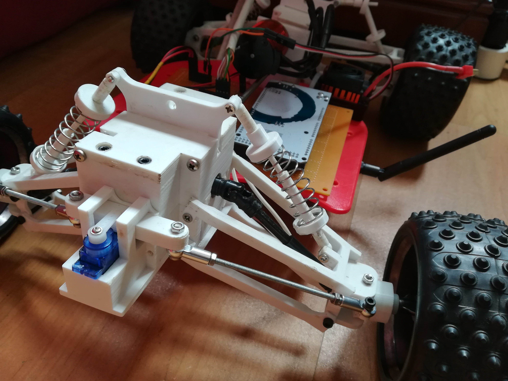
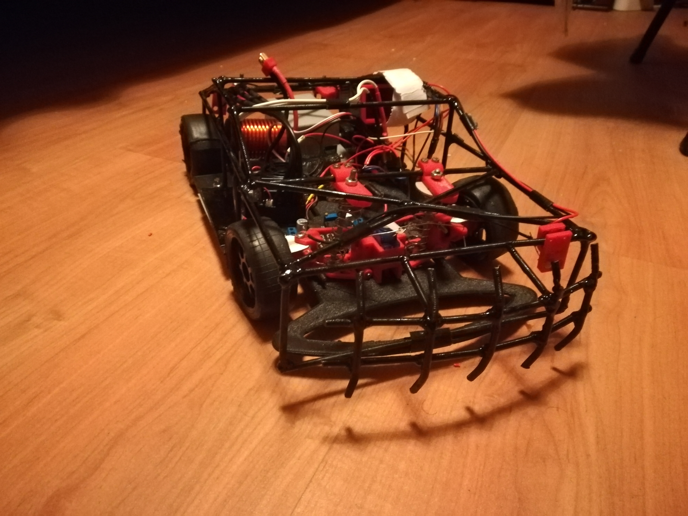

<!--
*** Thanks for checking out the Best-README-Template. If you have a suggestion
*** that would make this better, please fork the repo and create a pull request
*** or simply open an issue with the tag "enhancement".
*** Don't forget to give the project a star!
*** Thanks again! Now go create something AMAZING! :D
-->

<!-- PROJECT SHIELDS -->
<!--
*** I'm using markdown "reference style" links for readability.
*** Reference links are enclosed in brackets [ ] instead of parentheses ( ).
*** See the bottom of this document for the declaration of the reference variables
*** for contributors-url, forks-url, etc. This is an optional, concise syntax you may use.
*** https://www.markdownguide.org/basic-syntax/#reference-style-links
-->
[![Contributors][contributors-shield]][contributors-url]
[![Forks][forks-shield]][forks-url]
[![Stargazers][stars-shield]][stars-url]
[![Issues][issues-shield]][issues-url]
[![MIT License][license-shield]][license-url]
[![LinkedIn][linkedin-shield]][linkedin-url]

<!-- PROJECT LOGO -->
 

  

  <h3 align="center">Autonomous Car</h3>

  

    It's an atounomous car that uses GPS.
     
     
    <a href="https://github.com/andrefdre/Carro/issues">Issues</a>
    ·
    <a href="https://github.com/andrefdre/Carro/projects/1">Project</a>
    ·
    <a href="https://github.com/andrefdre/Carro/wiki">Wiki</a>
  

<!-- TABLE OF CONTENTS -->

  
Table of Contents

  <ol>
    <li><a href="#Introduction">Introducion</a></li>
    <li><a href="#Libraries">Libraries</a> </li> 
    <li><a href="#License">License</a></li>
    <li><a href="#Contact">Contact</a></li>
  </ol>

<!-- Introduction -->
## Introduction

This projected started in the beggining of my university and I setup myself to build an autonumous car that could drive alone. 

The main objective was to make the car and add GPS navigation so it could have coordinates previously set up and then run that course. 

So it all started with the mechanical part of the project with the palns to be 4 wheel drive and have a better suspension than the previous version. The components were mostly 3D printed and only the shafts and some other parts where bought. 

After that, started the developemnt of the eletrical componnets alongside the programming of the code. This part was the most difficult since I had lots of problems with the communication beetwen the car and the controller.  

The previous version used bluetoth chips but since the range was very limited i eventualy changed to RF24 chips wich use radio waves that has more range.  

 Previous version: 
 

For more see the [open issues](https://github.com/andrefdre/Carro/issues) for a full list of proposed features (and known issues).

(<a href="#top">back to top</a>)

<!-- Required_Libraries -->
## Libraries 

The arduino code requires some dependencies:
<ol>
    <li><a href="https://github.com/embeddedartistry/arduino-printf">LibPrintf</a></li>
    <li><a href="https://forum.hobbycomponents.com/viewtopic.php?t=2034">HCPCA9685</a> </li> 
    <li><a href="https://www.arduino.cc/en/reference/SPI">SPI</a></li>
    <li><a href="https://github.com/nRF24/RF24">RF24</a></li>
    <li><a href="https://www.arduino.cc/reference/en/libraries/libprintf/">LibPrintf</a></li>
  </ol>

(<a href="#top">back to top</a>)

<!-- LICENSE -->
## License

Distributed under the GNU GENERAL PUBLIC LICENSE. See `LICENSE.txt` for more information.

(<a href="#top">back to top</a>)

<!-- CONTACT -->
## Contact

André Cardoso - andref@ua.pt

Project Link: [https://github.com/andrefdre/Carro](https://github.com/andrefdre/Carro)

(<a href="#top">back to top</a>)

<!-- MARKDOWN LINKS & IMAGES -->
<!-- https://www.markdownguide.org/basic-syntax/#reference-style-links -->
[contributors-shield]: https://img.shields.io/github/contributors/andrefdre/Carro.svg?style=for-the-badge
[contributors-url]: https://github.com/andrefdre/Carro/graphs/contributors
[forks-shield]: https://img.shields.io/github/forks/andrefdre/Carro.svg?style=for-the-badge
[forks-url]: https://github.com/andrefdre/Carro/network/members
[stars-shield]: https://img.shields.io/github/stars/andrefdre/Carro.svg?style=for-the-badge
[stars-url]: https://github.com/andrefdre/Carro/stargazers
[issues-shield]: https://img.shields.io/github/issues/andrefdre/Carro.svg?style=for-the-badge
[issues-url]: https://github.com/andrefdre/Carro/issues
[license-shield]: https://img.shields.io/github/license/andrefdre/Carro.svg?style=for-the-badge
[license-url]: https://github.com/andrefdre/Carro/blob/main/LICENSE
[linkedin-shield]: https://img.shields.io/badge/-LinkedIn-black.svg?style=for-the-badge&logo=linkedin&colorB=555
[linkedin-url]: https://www.linkedin.com/in/andr%C3%A9-cardoso-8bb264223/
[product-screenshot]: Images/Logo.jpg
